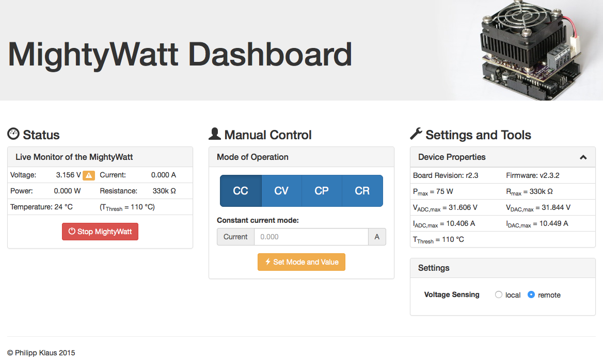

## MightyWatt powered by Python

This is a Python package with a web interface for the [MightyWatt][],
a great programmable electronic load for the Arduino Uno/Due.

The [MightyWatt][] is an Arduino shield designed as a constant-current /
constant-voltage load. It uses a FET in linear mode to create an
adjustable resistance.

### Installation

Installing this Python package is as simple as:

    pip install https://github.com/pklaus/MightyWatt_Python/archive/master.zip

### Starting the web server

Here is how you start the web server, just adapt
to the name of the serial port of your MightyWatt hardware:

    mw_web_server /dev/ttyACM0

The web server will then be available at <http://localhost:8001>
and the web page will look like this:



You can stop the web server by pressing `[Ctrl]-[C]`. (This might take a few seconds.)

The web server comes with the user interface shown above but it **also provides
an API** to control the MightyWatt with simple HTTP request:

To set constant current mode with 1.0 Amps:

    curl http://localhost:8001/api/mode/cc/1.0

To set remote voltage sensing:

    curl http://localhost:8001/api/voltage-sensing/remote

To stop the load:

    curl http://localhost:8001/api/stop

### Controlling the load with the web client

You can use the web server API to script a program for the load.
This software already comes with a a script to do simple tasks such as ramping current etc.:

    mw_web_client \
      --watchdog 'V>0.5' \
      --remote \
      http://localhost:8001 \
      ramp CC 0 1.3 \
      --duration 600

This will ramp the current from 0 to 1.3 Amps in 600 seconds.
It will use the remote sensing feature and stop if the voltage drops below 0.5 Volts.
The output of the script to stdout looks like the log files of the MightyWatt Windows software:

    MightyWatt Log File
    Started on	15/03/2015	08:54:10 PM
    Current [A]	Voltage [V]	Time since start [s]	Temperature [deg C]
    0.000	4.864	0.000	21
    0.000	4.860	0.098	21
    0.000	4.864	0.196	21
    0.000	4.860	0.295	21
    0.000	4.867	0.393	21
    0.000	4.862	0.491	21
    0.000	4.868	0.590	21
    [...]

### Using the Python module without the web server

If you want to create scripts using the MightyWatt and don't want to
use the web server for some reason, you can also simply use the
MightyWatt object to controll the load programmatically:

```python
from mightywatt import MightyWatt
import time

mw = MightyWatt('/dev/tty.usbmodemfd121')
mw.print_status()
mw.set_cc(1.00)
mw.print_status()
mw.set_update_rate(100)
time.sleep(0.5)
mw.print_status()
time.sleep(0.5)
mw.print_status()
#mw.set_remote()
mw.print_status()
mw.set_cp(2.5)
mw.print_status()
mw.stop()
mw.close()
```

### Requirements

This Python software requires these external dependencies:

* [pySerial](http://pyserial.sourceforge.net/)
* [Bottle](http://bottlepy.org)

Both should be automatically fetched and installed from PyPI.

### Author

* The MightyWatt is an open hardware/open software product
  developed by Jakub Polonský, available for sale
  at [Tindie](https://www.tindie.com/products/Kaktus/mightywatt-kit-70-watt-electronic-load-for-arduino/).
* This software was written by Philipp Klaus.

[MightyWatt]: http://kaktuscircuits.blogspot.cz/2014/07/mightywatt-revison-2-now-50-mightier.html

